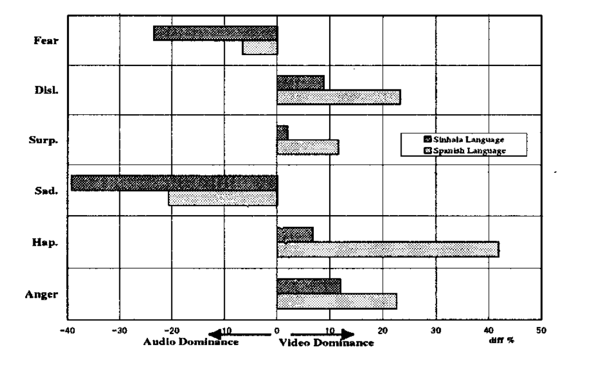
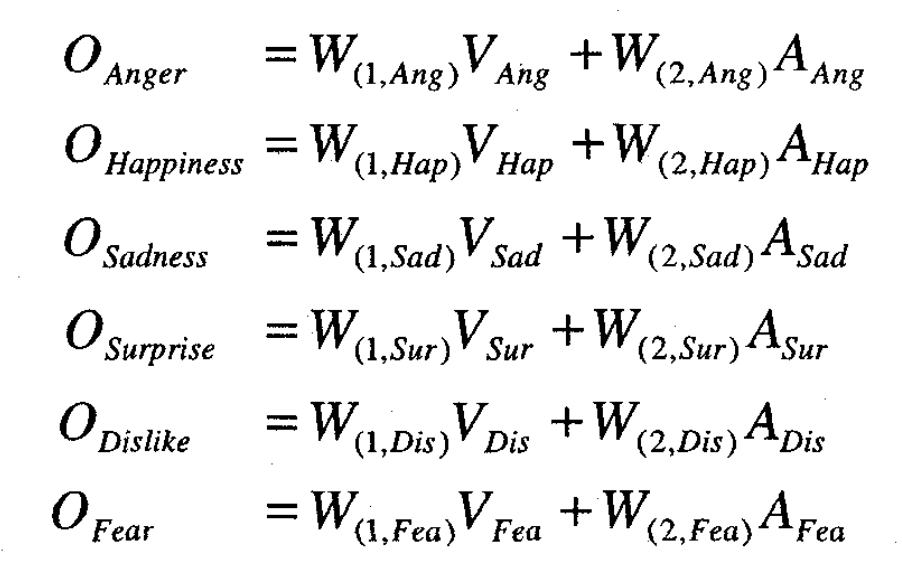
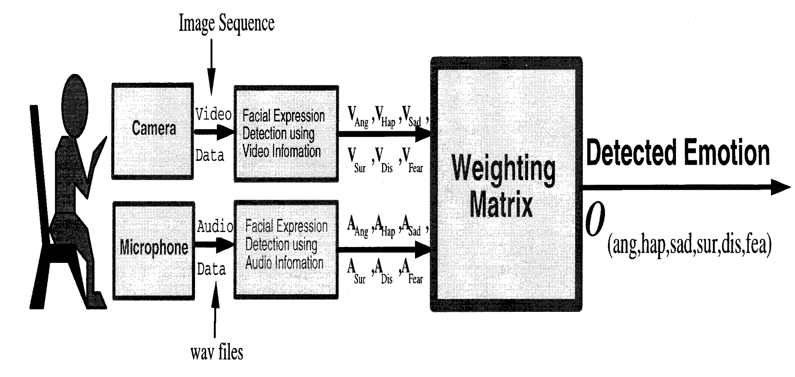

# FER Multi-modal Information
#### Facial Emotion Recognition Using Multi-modal Information
##### Published as a conference paper at ICICS 1997
##### C. DE SILVA∗, MIYASATO**,  NAKATSU **,
##### ∗ National University of Singapor   ** Advanced Telecommunications Research Center (ATR)

## Problem

The research addresses the challenge of efficient facial expression recognition in multi-cultural visual communication. Currently, computer vision focuses on facial displays, while acoustic research tackles vocal expressions, often treating visual and auditory cues separately.

## Importance

Facial emotion recognition is deemed vital for future multi-cultural communication systems, akin to speech translation. Understanding emotions beyond facial expressions is crucial for building effective interfaces in human-computer communication. The study emphasizes the importance of integrating both auditory and visual information, hoping that this multi-modal approach will become a standard in future multimedia processing.

## Insights

Through subjective evaluation studies, the researchers found that human beings predominantly recognize Anger, Happiness, Surprise, and Dislike through visual appearance compared to voice-only detection. Sadness and Fear, on the other hand, were found to be more audio-dominant. Dislike emotion exhibited mixed responses to different speakers. This insight led to the proposal of a hybrid approach, using both audio and visual information for facial emotion recognition.

## Mechanism

The researchers conducted experiments with two speakers (Spanish and Sinhala) recording emotional video clips in an incomprehensible language. The evaluation involved presenting these clips to subjects, assessing three types of media clips: audio-only, video-only, and both audio and video. The researchers calculated video and audio dominance for each emotion, revealing the influence of visual and auditory cues.

## Results

The subjective evaluation studies indicated that video was more dominant in recognizing Anger, Happiness, Surprise, and Dislike, while audio was dominant for Sadness and Fear. A proposed hybrid approach combining both modalities aims to enhance facial emotion recognition. The research also delved into emotion misclassification analysis, revealing conflicting results for Sinhala language video-based cases, potentially indicating cultural nuances in emotion interpretation. The study concludes with plans for system implementation based on the observed findings.

