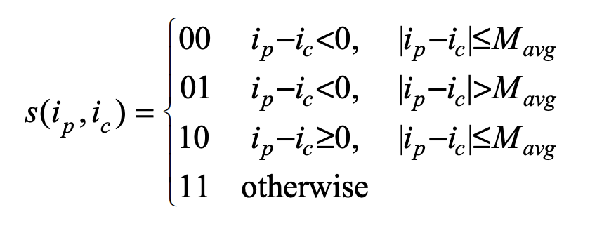
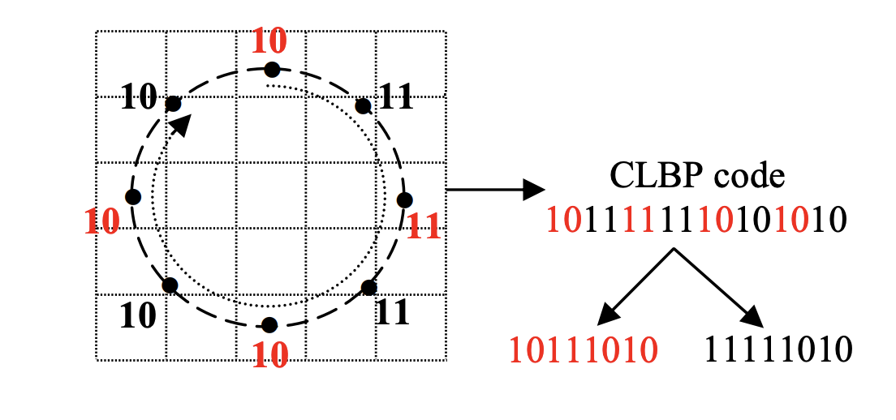
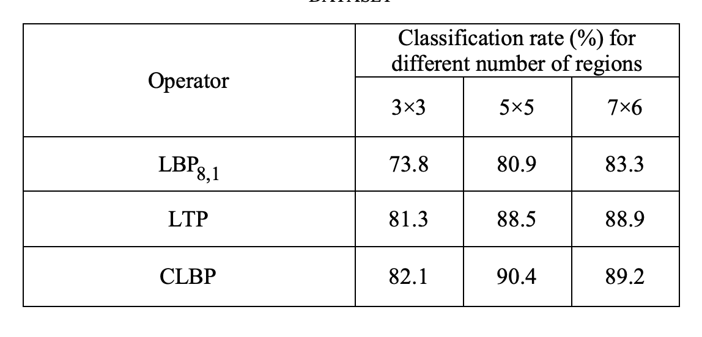

# CLBP
#### Compound Local Binary Pattern (CLBP) for Robust Facial Expression Recognition
##### Published as a conference paper at CINTI 2011
##### Faisal Ahmed∗, Emam Hossain**,  A.S.M. Hossain Bari **,
##### ∗  Department of CIT, Islamic University of Technology   ** Department of CSE, Prime University

## Problem

The existing local binary pattern (LBP) operator, while effective for facial feature representation, discards important texture information by only encoding the signs of differences between gray values. This limitation poses challenges in efficient facial expression recognition, especially in the presence of variations such as illumination, pose, and noise.

## Importance

Facial expression recognition plays a crucial role in human-computer interaction, data-driven animation, and various applications. Improving the accuracy and robustness of facial feature representation is essential for automated systems to correctly interpret and respond to human emotions.

## Insights

The paper introduces a novel local texture operator, the compound local binary pattern (CLBP), which addresses the limitations of the traditional LBP by incorporating additional bits to encode the magnitude information of differences between center and neighbor gray values. This enhancement aims to improve robustness and performance in facial expression recognition.

## Mechanism

CLBP combines extra bits with the original LBP code to represent both the sign and magnitude of differences between gray values in a local neighborhood. The encoding scheme increases the discriminative ability of the feature representation. The paper also proposes a feature representation method based on CLBP codes for facial expression recognition.

## Results

Experimental results using the Cohn-Kanade facial expression database demonstrate the superiority of CLBP over traditional LBP and local ternary pattern (LTP) operators. CLBP achieves higher recognition rates, indicating its effectiveness in providing a more robust and accurate facial feature representation. The proposed method shows promise for person-independent facial expression recognition in various scenarios.

