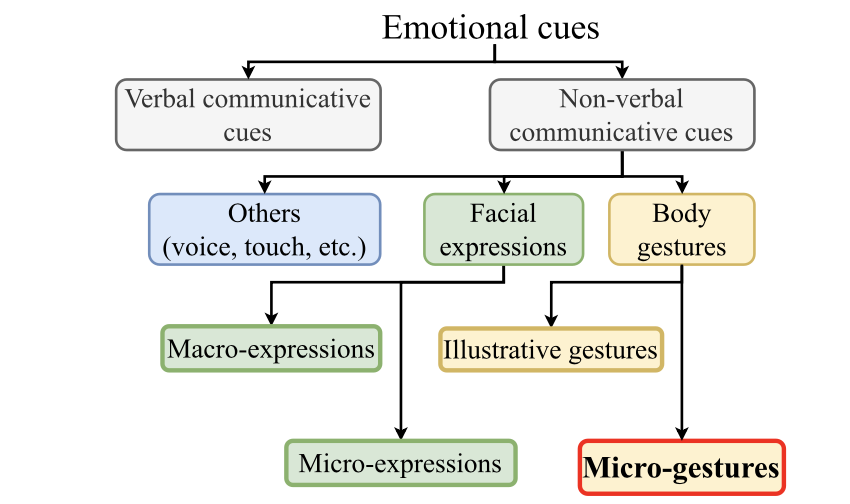
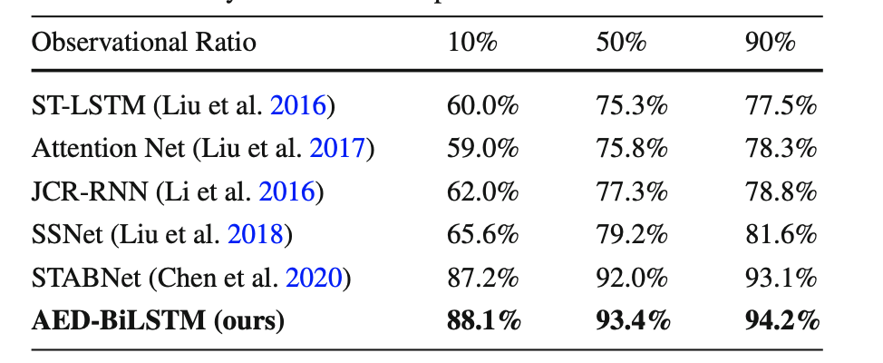

# SMG
#### A Micro-gesture Dataset Towards Spontaneous Body Gestures for Emotional Stress State Analysis
##### Published as a conference paper at CINTI 2011
##### Haoyu Chen∗, Henglin Shi*,  · Xiaobai Li* Guoying Zhao*, · Xin Liu **,
##### ∗  Center for Machine Vision and Signal Analysis (CMVS),University of Oulu, Oulu, Finland  , ** School of Engineering Science, Lappeenranta-Lahti University of Technology LUT

  

## Problem

The study addresses the challenging problem of recognizing micro-gestures (MGs) associated with hidden emotional states using computer vision. Traditional methods often focus on facial expressions, but interpreting subtle body movements, especially micro-gestures, remains a complex task. Understanding these gestures could significantly contribute to emotion recognition systems, offering insights into psychological states not easily discernible through conventional means.

## Importance

Recognizing hidden emotional states through micro-gestures can have profound applications in various fields, including human-computer interaction, mental health assessments, and emotion-aware technologies. The importance lies in the potential to enhance emotional intelligence systems, improving their accuracy and applicability in real-world scenarios. This research could pave the way for more nuanced and reliable emotion recognition models, impacting fields such as psychology, human-computer interaction, and artificial intelligence.

## Insights

The study provides insights into the challenges and intricacies of interpreting micro-gestures related to hidden emotional states. It highlights the limitations of previous approaches, especially those relying solely on facial expressions. The research introduces a novel dataset (SMG dataset) capturing diverse micro-gestures associated with different emotional stress states. Furthermore, the comparison between RGB and skeleton modalities sheds light on the superiority of skeleton-based models for micro-gesture classification, emphasizing the importance of depth information in distinguishing subtle movements.

## Mechanism

The mechanism involves using advanced machine learning models, such as Graph Convolutional Networks (GCNs), for recognizing micro-gestures. The study employs a comprehensive dataset with carefully designed tasks to elicit hidden emotional states, creating a robust foundation for model training and evaluation. The proposed models adaptively leverage the temporal information encoded in skeleton data, enabling accurate classification of micro-gestures associated with various emotional stress states.

## Results

The experimental results demonstrate the effectiveness of the proposed models, particularly the superiority of skeleton-modality-based methods over RGB-modality-based ones. MS-G3D stands out as the top-performing model, showcasing the potential of graph convolutional-based approaches for micro-gesture classification. The study provides a benchmark for evaluating state-of-the-art models on the SMG dataset, emphasizing the challenges posed by inter-class variations and long-tail issues in this specific context.

