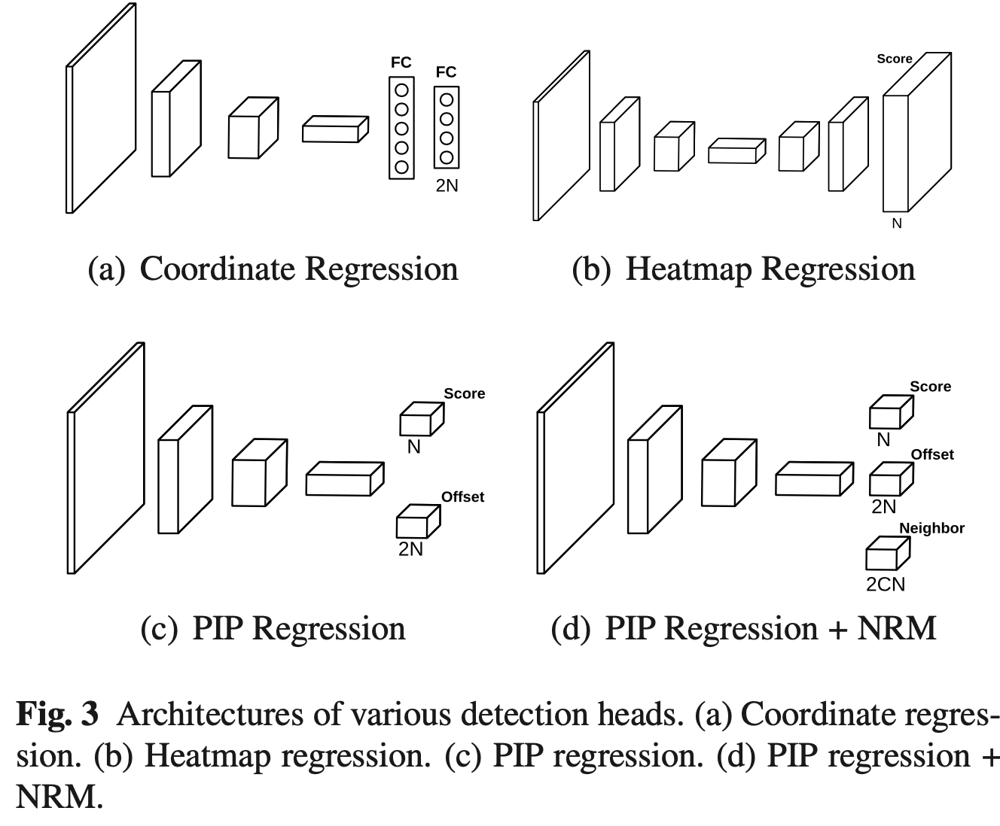

# Pixel-in-Pixel Net
#### Towards Efficient Facial Landmark Detection in the Wild
#####  International Journal of Computer Vision , Published: 16 September 2021
##### Haibo Jin1 · Shengcai Liao1 · Ling Shao1,2
##### 1 Inception Institute of Artificial Intelligence (IIAI),2 Mohamed bin Zayed University

  

## Problem

The field of facial landmark detection faces several challenges, including computational expense, lack of explicit constraints on global shapes, and common domain gaps. Existing models, while effective, struggle with these issues, impacting their efficiency, accuracy, and generalization capabilities.

## Importance

Facial landmark detection is crucial for various face analysis tasks, such as face recognition, tracking, and editing. In real-world, uncontrolled environments, detectors must be accurate, robust, and computationally efficient simultaneously. The identified problems hinder the development of models that meet these criteria, making it essential to find innovative solutions.

## Insights

The proposed Pixel-in-Pixel Net (PIPNet) addresses these challenges by introducing a novel detection head based on heatmap regression. This not only reduces computational costs significantly but also maintains competitive accuracy. The addition of a neighbor regression module enhances robustness, particularly across different domains. Furthermore, the exploration of self-training with a curriculum for generalizable semi-supervised learning shows promise in improving cross-domain generalization capabilities, offering a scalable and data-driven solution to address domain gaps. The integration of these elements in PIPNet demonstrates a holistic approach to advancing facial landmark detection.

## Mechanism

## Results

