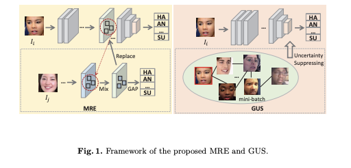

#### Adaptive Graph-Based Feature Normalization for Facial Expression Recognition
#####  International Journal of Computer Vision , Published: 16 September 2021
##### Yangtao Du · Qingqing Wang* · Yujie Xiong
##### Fudan University,Shanghai Jiao Tong Univeristy*

  

## Problem

Facial Expression Recognition (FER) encounters challenges due to data uncertainties, including ambiguous facial images and subjective annotations. This leads to issues such as semantic and feature covariate shifting, where the model's performance is affected by mislabeled data.

## Importance

FER is crucial for machines to understand human emotions and intentions. Despite significant progress, the data uncertainty problem hampers the effectiveness of FER models. Mislabeling and ambiguity in facial images can lead to inaccurate predictions. Addressing this issue is vital for improving the reliability of FER technology in various applications, such as human-computer interaction and emotion-aware systems.

## Insights

The proposed Adaptive Graph-based Feature Normalization (AGFN) method provides a novel solution by normalizing feature distributions based on the associations of expressions. Unlike existing approaches that focus on correcting mislabeled data or guiding training with clean data knowledge, AGFN considers the associative relations of facial expressions. The use of a Poisson graph generator and Graph Convolutional Network (GCN) enables the model to adaptively construct topological graphs, conveying semantic information of associated samples. The insight here is that by leveraging the relationships between expressions, the model becomes more robust to uncertainties, resulting in improved FER performance, even in the presence of mislabeled data.

## Mechanism

## Results

