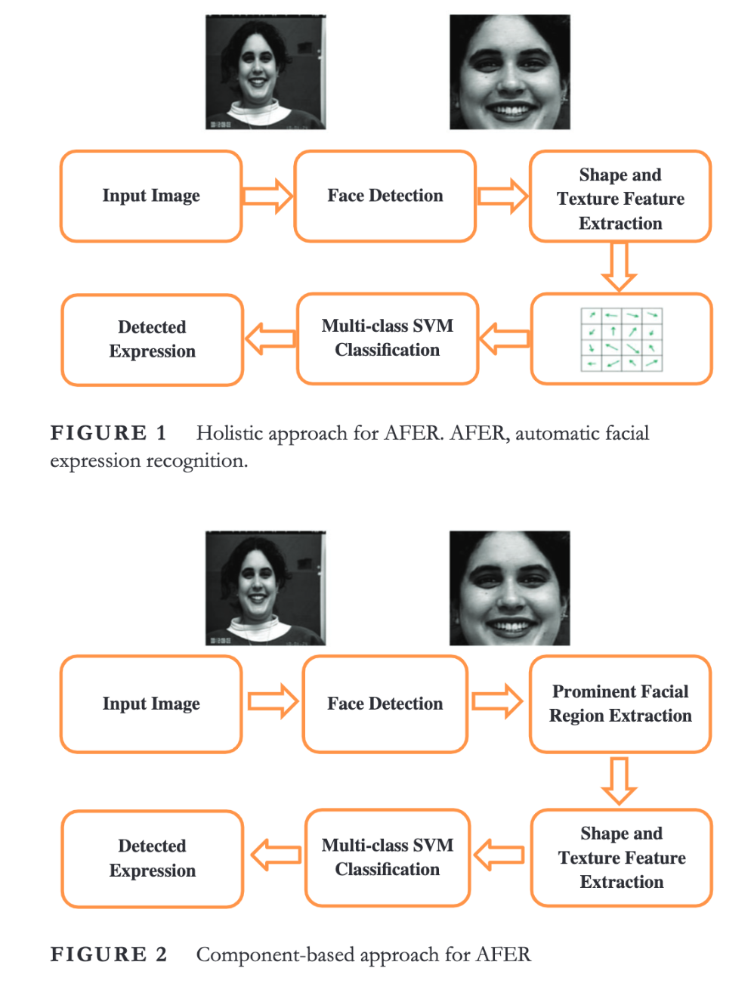

####  AFER
#### Automatic facial expression recognition combining texture andshape features from prominent facial regions
##### IET Image ProcessingVolume 17, Issue 4 , Mar 2023
##### Naveen Kumar H N · A Suresh Kumar · Guru Prasad M . Mohd Asif Shah
##### Department of Electronics and CommunicationEngineering, Vidyavardhaka College of Engineering , Department of Computer Science and Engineering,Graphic Era

  

## Problem

The existing methods for Automatic Facial Expression Recognition (AFER) often focus on global feature extraction, assuming equal contribution from all facial regions. However, the detection and localization of facial regions with significant contributions to expression recognition and the extraction of highly discriminative features from those regions are not fully explored.

## Importance

Facial expressions are a crucial form of non-verbal communication, playing a vital role in various daily tasks and interactions. AFER systems have applications in human-computer interaction, healthcare, security, and more. Improving AFER accuracy is essential for creating more natural and effective human-computer interfaces and for addressing challenges in areas like lie detection, education, and assistive healthcare technologies.

## Insights

The proposed work suggests a novel approach that combines shape and texture features, such as Local Phase Quantization, Local Binary Pattern, and Histogram of Oriented Gradients, to enhance the recognition rate of AFER systems. The emphasis is on determining the contribution of facial regions and identifying prominent facial regions that provide highly discriminative information for expression recognition. The results show a significant improvement in recognition rates compared to existing methods, demonstrating the effectiveness of the proposed approach.

## Mechanism

## Results

